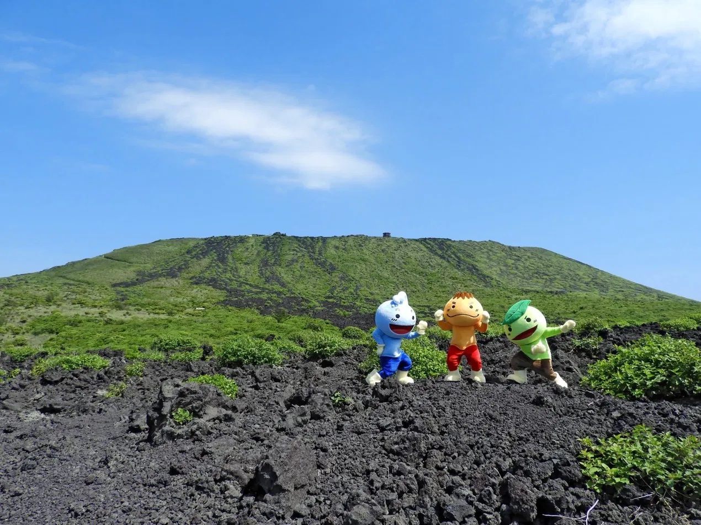

# C-BASE｜伊豆大島ジオガイド 公式サイト

伊豆大島ジオパーク認定ジオガイド 西本裕樹による、C-BASEジオガイドツアーの公式Webサイトです。

---

## ファイル構成

```
c-base/
├── index.html          # メインHTML（1ページ完結型ランディングページ）
├── styles.css          # スタイルシート（スマホファースト）
├── script.js           # JavaScript（ナビ・アニメーション・フォーム）
├── README.md           # このファイル
└── assets/
    └── images/         # 差し替え用画像フォルダ
        ├── hero-sangenzan.jpg        # ヒーロー背景（三原山）
        ├── tour-sangenzan.jpg        # ツアー1 サムネイル
        ├── tour-urasabaku.jpg        # ツアー2 サムネイル
        ├── tour-arrange.jpg          # ツアー3 サムネイル
        ├── tour-group.jpg            # ツアー4 サムネイル
        ├── guide-nishimoto.jpg       # ガイド写真
        ├── villa-limone.jpg          # Villa Limone
        ├── hotel-narumi.jpg          # HOTEL Narumi
        ├── c-base.jpg                # C-BASE施設
        └── og-image.jpg              # OGP用画像（1200×630px推奨）
```

---

## ローカルで確認する方法

### 方法A：ブラウザで直接開く
`index.html` をブラウザにドラッグ＆ドロップするだけで確認できます。

### 方法B：ローカルサーバーを使う（推奨）
```bash
# Python 3 がある場合
cd c-base
python3 -m http.server 8080
# → http://localhost:8080 で確認

# Node.js がある場合
npx serve .
# → 表示されたURLで確認
```

---

## 画像の差し替え方法

1. `assets/images/` フォルダに画像を配置する
2. `index.html` 内の `img-placeholder` クラスのdivを `` タグに差し替える

```html
<!-- 差し替え前（仮） -->
<div class="img-placeholder img-volcano">...</div>

<!-- 差し替え後 -->

```

**推奨画像サイズ：**
- ヒーロー背景: 1920×1080px
- ツアーサムネイル: 800×450px（16:9）
- ガイド写真: 600×760px（縦長）
- 施設写真: 800×560px
- OGP画像: 1200×630px

**画像フォーマット:** JPGまたはWebP（圧縮してファイルサイズを小さくすると読み込みが速くなります）

---

## 問い合わせフォームの接続方法

### A) Formspree（おすすめ・無料プランあり）
1. https://formspree.io でアカウント作成
2. 「New Form」でフォームを作成 → IDをコピー（例: `xrgvkpqz`）
3. `index.html` の `<form>` タグを修正:
   ```html
   <form class="contact-form" action="https://formspree.io/f/xrgvkpqz" method="POST">
   ```
4. `script.js` のフォームイベントリスナーを削除

### B) Netlify Forms（Netlifyで公開する場合・無料）
1. `<form>` タグに `netlify` 属性を追加:
   ```html
   <form class="contact-form" netlify name="contact" method="POST">
   ```
2. Netlifyにデプロイするだけで自動認識
3. Netlifyダッシュボードの「Forms」で受信確認

### C) Googleフォーム（最もシンプル）
1. Googleフォームでフォームを作成・公開
2. 「送信」ボタン → `<>` アイコン → 埋め込みHTMLをコピー
3. `index.html` の Googleフォームコメントブロックを解除し、
   iframeのURLを差し替える
4. 既存の `<form id="contactForm">` ブロックを削除

---

## LINE予約ボタンの追加方法

1. LINE公式アカウントの管理画面で「友だち追加URL」を確認
2. `index.html` の `<!-- LINE予約ボタン -->` コメントブロックを解除:
   ```html
   <a href="https://line.me/R/ti/p/@YOUR_LINE_ID" class="btn btn-line" target="_blank" rel="noopener">
     LINEで相談する
   </a>
   ```
3. `@YOUR_LINE_ID` を実際のLINE IDに変更

---

## Googleフォーム連携方法

上記「C) Googleフォーム」を参照してください。

---

## 公開方法

### Netlify（おすすめ）
1. https://app.netlify.com でログイン（GitHub/Google連携可）
2. 「Add new site」→「Deploy manually」
3. `c-base` フォルダをドラッグ＆ドロップ
4. 自動で公開URL発行（例: `c-base-xyz.netlify.app`）
5. 独自ドメインは「Domain settings」から設定

### Vercel
1. https://vercel.com でGitHubと連携
2. GitHubにリポジトリを作成してファイルをpush
3. Vercelで「Import Project」→ リポジトリを選択
4. 自動デプロイ

### GitHub Pages（無料）
1. GitHubリポジトリを作成
2. ファイルをpush
3. Settings → Pages → Source: Deploy from a branch → `main`/`master`
4. `https://username.github.io/repository-name/` で公開

---

## Google Analytics / Search Console の設定

`index.html` 内のコメントアウトを解除してトラッキングIDを設定:

```html
<!-- Google Analytics -->
<script async src="https://www.googletagmanager.com/gtag/js?id=G-XXXXXXXXXX"></script>
<script>
  window.dataLayer = window.dataLayer || [];
  function gtag(){dataLayer.push(arguments);}
  gtag('js', new Date());
  gtag('config', 'G-XXXXXXXXXX');
</script>
```

---

## 今後追加するとよいページ案

| ページ | URL | 内容 |
|--------|-----|------|
| 体験・ワークショップ | `/experience/` | 収穫体験、島の暮らし体験 |
| 宿泊情報 | `/stay/` | Villa Limone・HOTEL Narumi・C-BASE詳細 |
| 畑・農業体験 | `/farm/` | レモン、ホップ、野菜畑の体験 |
| 物産・お土産 | `/shop/` | レモン加工品、島の産品 |
| ブログ | `/blog/` | 島の今・ガイドの目線（SEOにも有効） |
| アクセス | `/access/` | 船・飛行機でのアクセス、島内移動 |
| スポットマップ | `/map/` | 三原山、裏砂漠、赤ダレなどのマップ |

---

## SEO改善チェックリスト

- [ ] Google Search Consoleへの登録・サイトマップ送信
- [ ] Googleビジネスプロフィールの作成
- [ ] 実画像のalt属性設定（必須）
- [ ] 画像のWebP化・圧縮（100KB以下を目標）
- [ ] Airbnb体験ページとの相互リンク
- [ ] 伊豆大島観光協会・地域メディアへの掲載依頼
- [ ] ブログ記事の定期投稿
- [ ] Core Web Vitals（PageSpeed Insights）の確認
